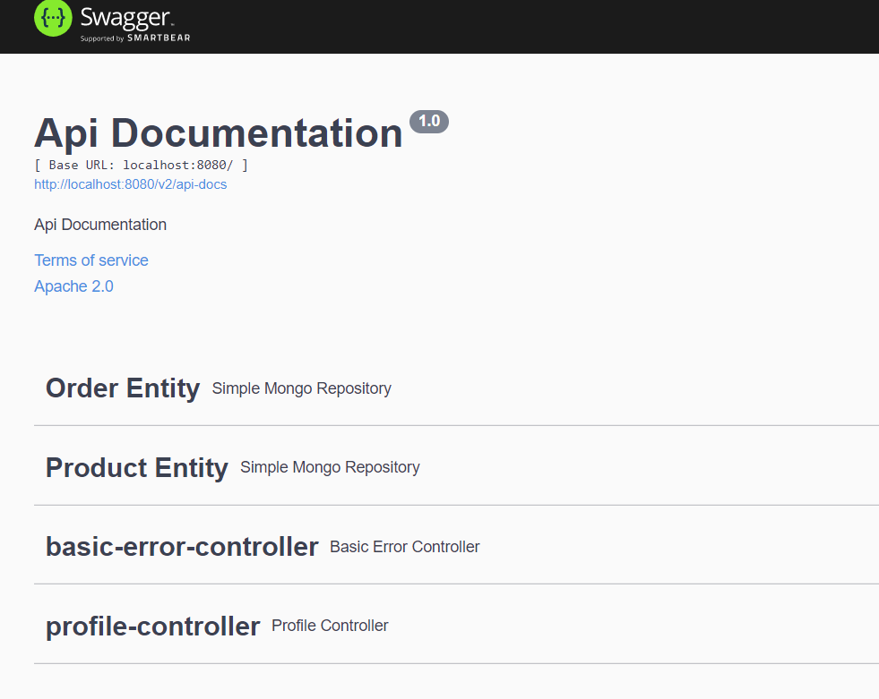

## Introduction

This simple inventory Spring Boot application demonstrates some REST handling basics.
As a persistent store <a href="https://www.mongodb.com/">MongoDB</a> NoSQL document data 
store would be used.

Prerequisites:

* JDK 1.8+
* Maven 3.6.0+
* Docker (Optional)

## Installation

* Clone or download application <a href="https://github.com/zhuchel/InventoryRestApp.git">sources</a>
from GitHub.

* Install <b>MongoDB</b> Community Edition from 
<a href="https://docs.mongodb.com/manual/installation/">https://docs.mongodb.com/manual/installation/</a> for your platform

* Alternately get <b>MongoDB</b> as Docker image  
`docker pull mongo`  
`docker run -d -p 27017-27019:27017-27019 --name mongodb mongo`

* Switch to <i>InventoryRestApp</i> folder and run  
  `mvn clean install`  
  This will compile sources and run intergation tests creating some test data.

* Run application with
`mvn spring-boot:run`

## Using Application

* Open Swagger console
`http://localhost:8080/swagger-ui.html`  

 

* Switch to <b>Product Entity</b>, POST ​/product saveProduct and create new Sample product
with following JSON:

 

Verify response code 201.

* Switch to <b>Product Entity</b>, /product findAllProduct and execute.  
Verify existence of a product with SKU 555

 

* Using Swagger UI you can play with other REST interfaces of the application.
